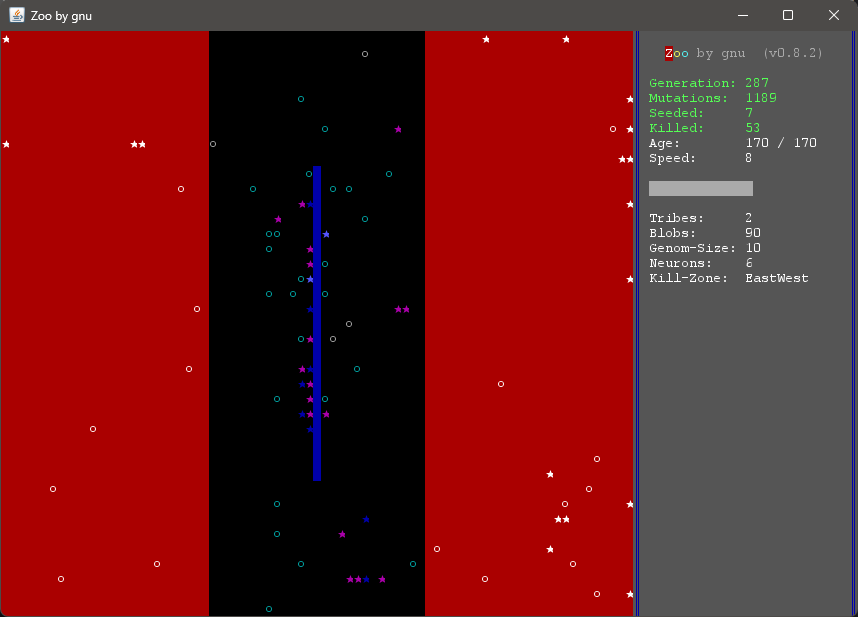

# Zoo, a play-field for genetic algorithms and neural networks

`Zoo` is a simulation of creatures ('blobs') operating on a rectangular field, using simple neural networks to calculate actions out of neural stimulus from 'sensors'. Inspired by this YouTube video: [I programmed some creatures. They Evolved.](https://www.youtube.com/watch?v=N3tRFayqVtk).

**Note: use `x`, `q` or `<Esc>` to exit the simulation. Do not use the close-icon from the window-frame or else the programm will continue to run and use up your CPU and RAM!** 

---



---

Build with Apache Maven:

`mvn clean package`

Run in a Java Runtime:

```
USAGE: java -jar target/zoo-0.5.1-SNAPSHOT-jar-with-dependencies.jar [-c <context>] [-g <genom>] [-d <delay>] [-?]

    -c <context> ... always use this context
    -g <genom>   ... use this genom as starting-point for every simulation
    -d <delay>   ... delay between steps for first simulation [ms]
```

Use the following keys to control the simulation:
```
    <Arrow-Right>       Accelerate the simulation
    <Arrow-Left>        Decelerate the simulation
    <Arrow-Up>          Only show the result of each generation (toggle)
    <Arrow-Down>        Rendering on/off (toggle)
    S                   Skip to the end of the current generation
    P                   Pause the simulation (toggle)
    N, <Enter>, <Space> Start the next (random) simulation
    X, Q, <Esc>         Exit the programm
```
